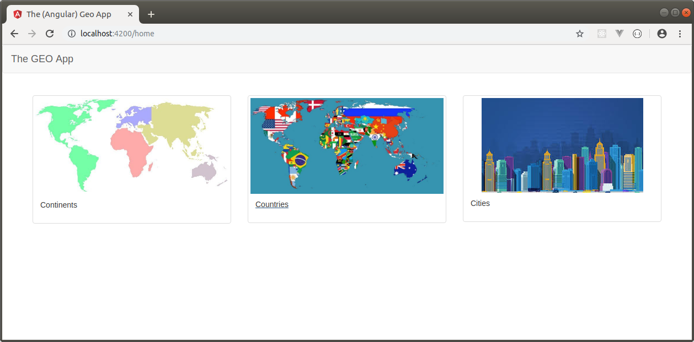
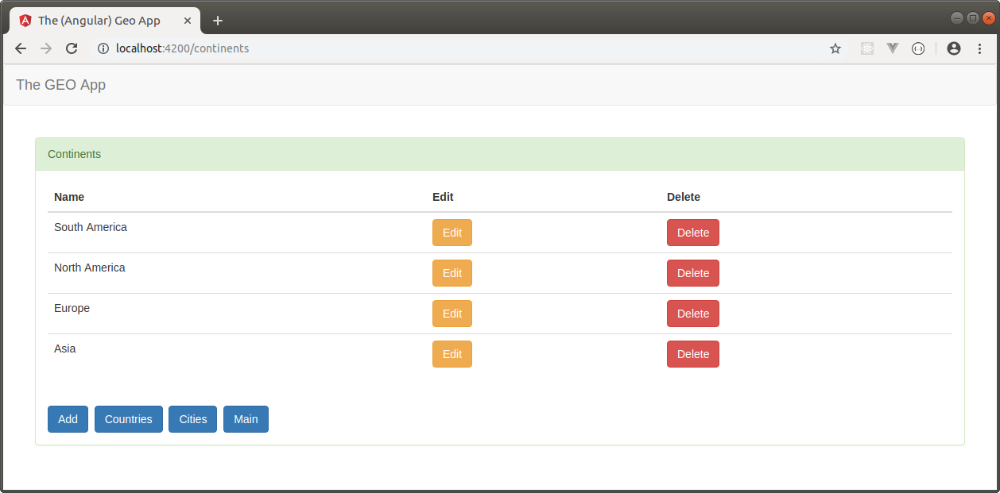
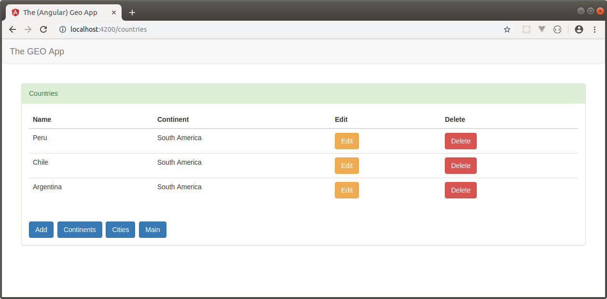
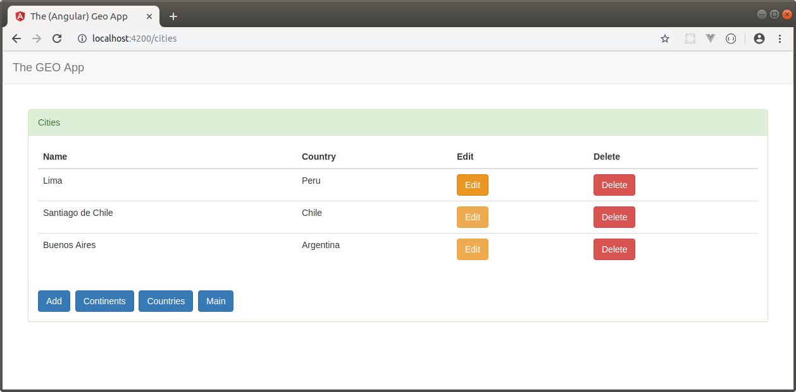

THE (ANGULAR) GEO APP CLIENT
--------------------------------------------------------------------------------------------------------------------

Aplicación SPA desarrollada con Angular 8 que almacena información de continentes, países y ciudades.

La aplicación utiliza el HttpClientModule para conectarse a una API Rest desarrollada con Spring Boot 
y que permite almacenar la información en MongoDB: 

https://github.com/edgar-code-repository/spring-boot-rest-geo-api

--------------------------------------------------------------------------------------------------------------------

Pantalla principal:

--------------------------------------------------------------------------------------------------------------------

Pantalla principal de CRUD de continentes:

--------------------------------------------------------------------------------------------------------------------

Pantalla principal de CRUD de paises:

--------------------------------------------------------------------------------------------------------------------

Pantalla principal de CRUD de ciudades:

--------------------------------------------------------------------------------------------------------------------

Git repository:  https://bitbucket.org/brightdog/angular_geo_app_client

