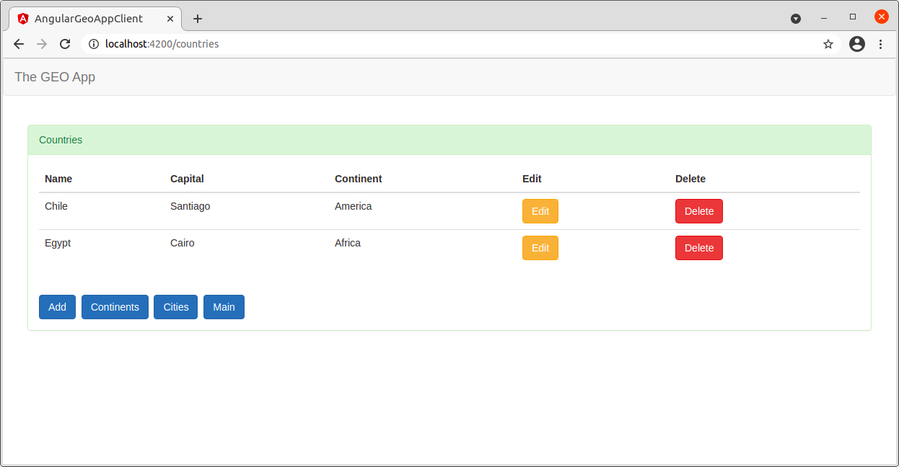

THE GEO APP CLIENT (ANGULAR 8)
--------------------------------------------------------------------------------------------------------------------

Angular application that shows information about continents, countries and cities.

This app uses a Rest API as backend to retrieve info: 

**THE GEO REST API (SPRING BOOT)**

https://github.com/edgar-code-repository/spring-boot-rest-geo-api

--------------------------------------------------------------------------------------------------------------------

Main screen:

--------------------------------------------------------------------------------------------------------------------

Continents:

--------------------------------------------------------------------------------------------------------------------

Countries:

--------------------------------------------------------------------------------------------------------------------

